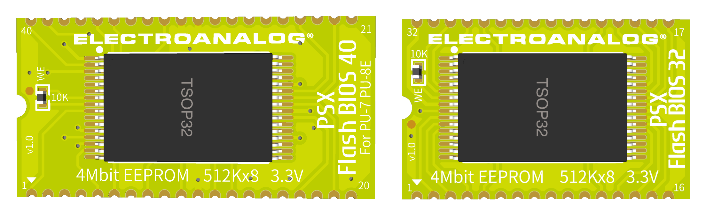
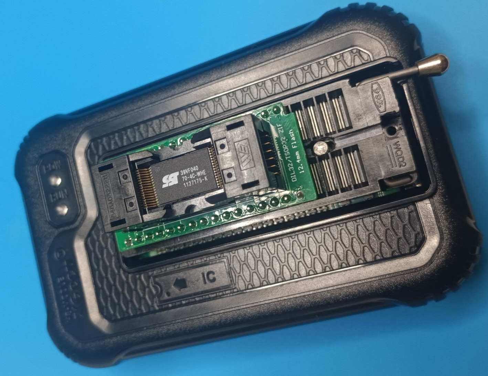
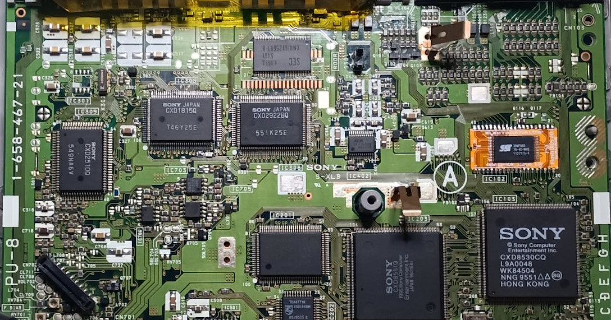
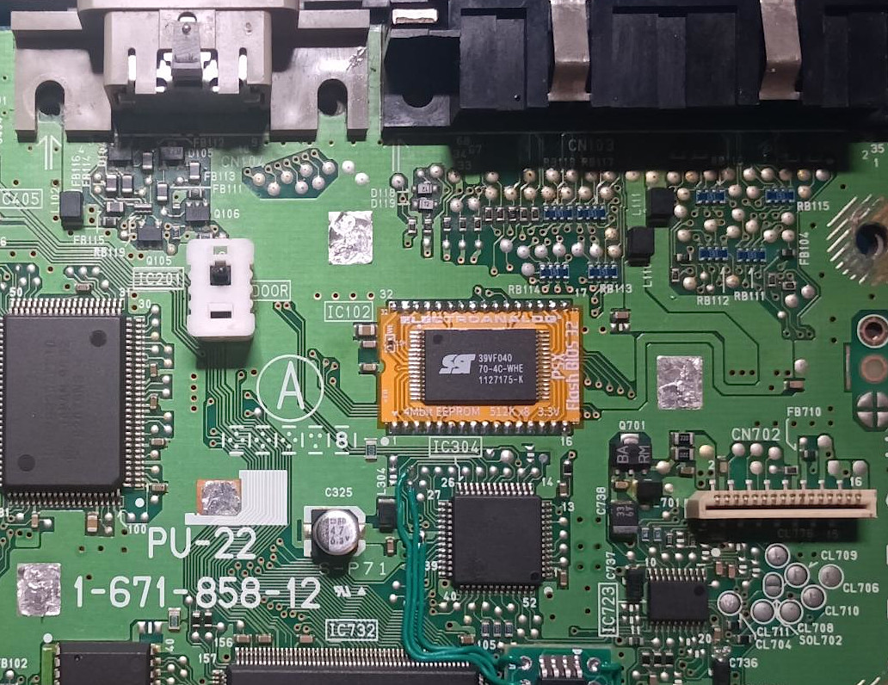
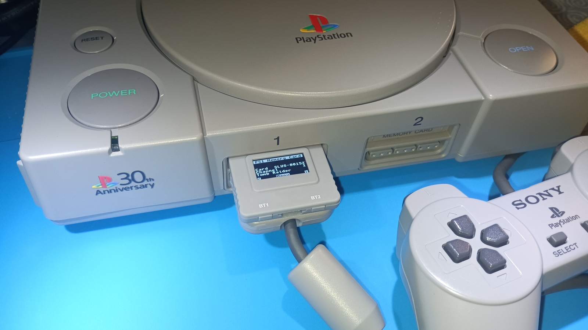

# PSX Flash BIOS 40 / 32

**PSX Flash BIOS** provides low-profile PCB adapter layouts for replacing the BIOS ROM (IC102) in original PlayStation (PS1) consoles with a 4 Mbit SST39VF040 EEPROM, pre-flashed with a Game ID-enabled BIOS patch from the [jdfr228/PS1-Disc-Based-Game-ID](https://github.com/jdfr228/PS1-Disc-Based-Game-ID) project.  

---

## Table of Contents

- [Supported Mainboards](#supported-mainboards)
- [Programming Notes](#programming-notes)
- [Flashing EEPROM](#flashing-eeprom-adapters-and-programmers)
- [PSX Flash BIOS Layouts](#psx-flash-bios-layouts)
- [Installation Notes](#installation-notes)
- [Gallery](#gallery)

---

## Overview

This project was created to address the lack of 40-pin BIOS adapters in the community, offering a reliable solution for early PS1 consoles (e.g., SCPH-100X series from 1994–1995) that were previously unsupported.  

Due to specific wiring on early 40-pin mainboards such as PU-7 and PU-8, it became possible to use the same SST39VF040 flash chip for both the 32-pin and 40-pin BIOS configurations. On these 40-pin boards, data lines D0 through D14 are physically present, and pin 29 (A0/D15) is tied to A0 because pin 31 (/BYTE) is held low-forcing 8-bit mode. This wiring ensures that only pins D0-D7 and A0-A18 are functionally valid, just like on 32-pin layouts. The result is full compatibility using a single chip without needing additional logic or memory configuration changes.

All adapter designs prioritize ultra-thin profiles using flex PCBs to ensure seamless, low-clearance installation directly on the mainboard.

Installing a BIOS patched with Game ID support offers significant advantages when used with accessories such as **MemCard Pro**, **SD2PSX**, **BlueRetro**, **PS1Digital**, and **Retro GEM**. With Game ID enabled, these devices can automatically detect the running game and perform actions like:

- Selecting the correct virtual memory card page  
- Applying per-game settings  
- Enhancing HDMI mods and controller mappings based on game context

When using a **PSIO** loader, Game ID functionality is provided dynamically via real-time patching. However, for games booted directly from **CD media**, this functionality requires a BIOS patched with Game ID support. Without it, compatible accessories will not detect any ID signal.

This is where the **PSX Flash BIOS** adapters come in. By replacing the stock ROM with a patched BIOS flashed onto an SST39VF040, even disc-based games on early consoles (with 40-pin BIOS) gain full compatibility with Game ID-aware hardware. No loader, exploit, or special startup process is required.  

---

## Supported Mainboards

| Adapter Variant      | Compatible Motherboards              | ROM Type   |
|----------------------|---------------------------------------|------------|
| PSX Flash BIOS 40    | PU-7, PU-8 (Early)                    | 40-pin BIOS |
| PSX Flash BIOS 32    | PU-8 (Late), PU-18, PU-20, PU-22, PU-23, PM-41, PM-41(2) | 32-pin BIOS |

---

## Programming Notes

**PSX Flash BIOS 40** and **PSX Flash BIOS 32** are designed for use with the SST39VF040 (4 Mbit) EEPROM.  

- EEPROM IC must be pre-flashed with a **Game ID-patched PS1 BIOS image**  
  ([see jdfr228/PS1-Disc-Based-Game-ID](https://github.com/jdfr228/PS1-Disc-Based-Game-ID))
- Use a compatible EEPROM programmer such as the T48 (TL866-3G).

---

## Flashing EEPROM (Adapters and Programmers)  

**Flashing:**  
Use a TSOP32 adapter compatible with the SST39VF040 in combination with a programmer such as the TL866II Plus or T48:  

- **Standard TSOP32 → DIP32 adapter**  
  Low-cost option. Requires soldering the EEPROM for each programming cycle.

- **CNV-TSOP-EP1M32 (ZIF, “Pin 9 to 1”) adapter**  
  Tool-free flashing with a Zero Insertion Force socket. No soldering required.

These adapters allow for straightforward flashing of SST39VF040 EEPROMs used with PSX Flash BIOS PCBs.  
Other programmers compatible with this IC and its footprint may be used as well.  

> [!NOTE]
> When flashing the EEPROM, no byte-swap is needed, as PS1 BIOS dumps use little-endian encoding as their native format.  

---

## PSX Flash BIOS Layouts

Ready-to-manufacture Gerber files for two adapter versions are included in this repository and can be downloaded from the [Releases](https://github.com/Electroanalog/PSX-Flash-BIOS/releases) section:

- [**40-pin version**](https://github.com/Electroanalog/PSX-Flash-BIOS/releases/download/v1.0/Gerber_PSX-BIOS_40PIN.zip): For early revisions such as **PU-7** and **PU-8 (early)** with a 40-pin BIOS Mask ROM  
- [**32-pin version**](https://github.com/Electroanalog/PSX-Flash-BIOS/releases/download/v1.0/Gerber_PSX-BIOS_32PIN.zip): For mainboards from **PU-8 (late)** onward that use a 32-pin BIOS Mask ROM  

 <b>Schematics and PCBs - Click to expand</b> 

<table>
  <tr>
    <td align="center">
       
      <strong>PSX Flash BIOS 40</strong> Schematic
    </td>
    <td align="center">
       
      <strong>PSX Flash BIOS 32</strong> Schematic
    </td>
  </tr>
  <tr>
    <td align="center">
       
      <strong>PSX Flash BIOS 40</strong> PCB Layout
    </td>
    <td align="center">
       
      <strong>PSX Flash BIOS 32</strong> PCB Layout
    </td>
  </tr>
</table>

> [!NOTE]
> Adapters are designed for flex or thin PCBs (≤ 0.8 mm) to ensure low-profile installation without mechanical interference.  

---

## PCB Manufacturing Recommendation

For prototyping and production of the **PSX Flash BIOS 40 / 32** adapters, we recommend **JLCPCB** as the primary manufacturing partner.  
Their consistent quality, competitive pricing, and fast turnaround make them an ideal choice for hobbyists and professionals alike.

  

Founded in 2006, **JLCPCB** is one of the world’s leading PCB and PCBA manufacturers, serving over 6 million customers across 180+ countries.  
Their fully automated production lines and digital ordering platform enable rapid delivery of high-reliability boards at low cost, ideal for prototyping and small-batch runs.

> [!NOTE]
> The PSX Flash BIOS adapters were prototyped and validated using Flex PCBs manufactured by JLCPCB.

### Recommended Specs

- **PCB Type:** Flex PCB  
- **Surface Finish:** ENIG (Default finish)  
- **PCB Thickness:** Standard: 0.11 mm (*Optional* 0.2 mm for improved rigidity)  
- **Coverlay Color:** Standard: Yellow (*Optional* Black or White)  
- **Layers:** 2  
- **Minimum Trace/Spacing:** Standard  

> [!IMPORTANT]
> Optional thickness and coverlay color increase production cost. Standard specs are fully compatible with this project.

JLCPCB frequently offers **discount coupons** and promotional pricing, making it a cost-effective option even for small quantities.  
Manufacturing and shipping times are impressively fast, with most orders processed and dispatched within a few business days.

---

## Installation Notes

- **Flex PCB** is recommended to ensure low-profile installation, proper fit and clearance on the PS1 mainboard.
- When using FR-4 PCBs, **castellated holes** may be required for edge-aligned soldering to the mainboard, which can increase manufacturing cost. In contrast, **flex PCBs with ENIG finish** are thinner, mechanically compliant, and typically more affordable for low-profile installations, eliminating the need for castellations while simplifying assembly.
- The original **SOP32 or SOP40 Mask ROM (IC102) must be desoldered from the PS1 mainboard using a hot air rework station**. This tool is essential for safe removal without damaging PCB pads or nearby components.  
- Place the EEPROM with correct orientation, matching the silkscreen markings on the **PSX Flash BIOS 40** or **PSX Flash BIOS 32** adapter. Carefully ensure that **all pins are precisely aligned with the PCB pads** before soldering.  
- Fine pitch soldering skills are essential.
- A **PCB inspection scope** is highly recommended to objectively verify solder quality on each IC pin, especially for fine-pitch packages like TSOP32.
- A **10 kΩ 0402 resistor** is used to pull the **WE** (Write Enable) pin high, putting the EEPROM in read-only mode. If preferred, a solder bridge can be used in place of the resistor.  
- Adapter boards have been tested and verified on real hardware, including SCPH-1000, SCPH-1001, and SCPH-7501 consoles.

---

## Gallery
*PSX Flash BIOS 40 and 32 built in Flex PCB*  
  

*PSX Flash BIOS 40 installed on a fully MLCC-recapped PU-8 mainboard from an SCPH-1001 console*  
  

*PSX Flash BIOS 32 installed on a PU-22 mainboard from a SCPH-7501 console*  
  

*PSX Flash BIOS working with PSxMemCard Gen2 on an SCPH-7501 console*  
  

---

## PSX Flash BIOS is also available on OSHWLab

  

---

## License

This project is licensed under the **CERN Open Hardware Licence Version 2 – Strongly Reciprocal (CERN-OHL-S v2)**.  
You may copy, modify, and distribute the design files, but any modified versions must also be licensed under the same terms.

For full license text, see the [LICENSE](LICENSE) file or visit the [CERN-OHL-S v2 official page](https://gitlab.com/ohwr/project/cernohl/-/wikis/Documents/CERN-OHL-version-2).

---

## Credits

Created by **Electroanalog® VICE (2025)**  
Built to complement the [*PS1 Disc-Based Game ID*](https://github.com/jdfr228/PS1-Disc-Based-Game-ID) BIOS patches by **James Dylan French (jdfr228)**  

*PlayStation is a registered trademark of Sony Interactive Entertainment LLC (SIE), formerly Sony Computer Entertainment Inc. (SCE). All rights reserved.*  

---

## Topics / Tags

`psx` `playstation` `bios-mod` `sst39vf040` `flexpcb` `game-id` `modchip` `retrogaming` `eeprom-adapter` `hardware-hack`

