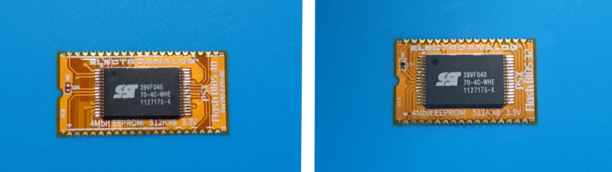
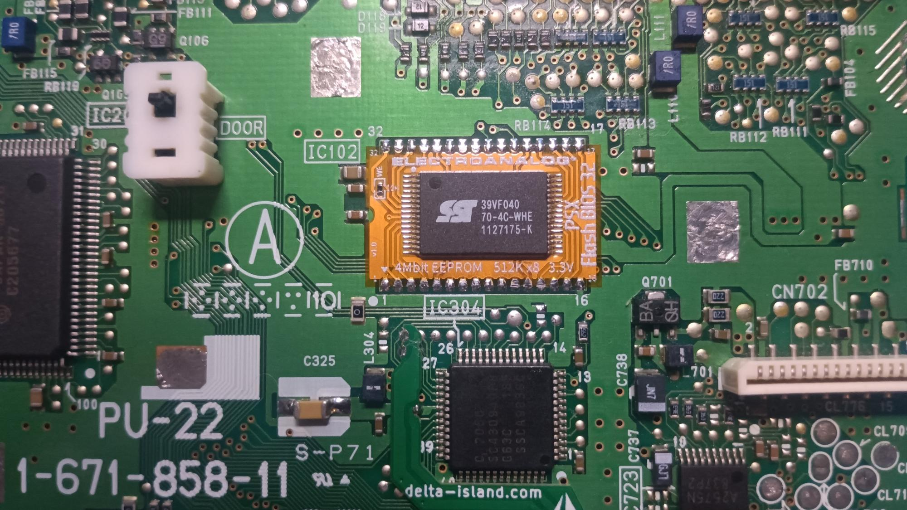

# PSX Flash BIOS 40 / 32

**PSX Flash BIOS** provides low-profile PCB adapter layouts for replacing the original PlayStation 1 BIOS ROM (IC102) with a 4Mbit SST39VF040 EEPROM, pre-flashed with a Game ID-enabled BIOS patch from the [jdfr228/PS1-Disc-Based-Game-ID](https://github.com/jdfr228/PS1-Disc-Based-Game-ID) project.  

---

## Table of Contents

- [Supported Mainboards](#supported-mainboards)
- [Installation Notes](#installation-notes)
- [Adapter Layouts](#adapter-layouts)
- [Programming Notes](#programming-notes)
- [Flashing EEPROM](#flashing-eeprom-adapters-and-programmers)  
- [Gallery](#gallery)
- [License](#license)
- [Credits](#credits)

---

## Overview

This project was created to address the lack of 40-pin BIOS adapters in the community, offering a reliable solution for early PS1 consoles (e.g., SCPH-100X series from 1994–1995) that were previously unsupported.  
All adapter designs prioritize ultra-thin profiles using flex PCBs to ensure seamless, low-clearance installation directly on the mainboard.

Installing a BIOS patched with Game ID support offers significant advantages when used with accessories such as **MemCard Pro**, **SD2PSX**, **BlueRetro**, **PS1Digital**, and **Retro GEM**. With Game ID enabled, these devices can automatically detect the running game and perform actions like:

- Selecting the correct virtual memory card page  
- Applying per-game settings  
- Enhancing HDMI mods and controller mappings based on game context

When using a **PSIO** loader, Game ID functionality is provided dynamically via real-time patching. However, for games booted directly from **CD media**, this functionality depends entirely on having a BIOS that includes the Game ID patch. Without it, compatible accessories will not detect any ID signal.

This is where the **PSX Flash BIOS** adapters come in. By replacing the stock ROM with a **Game ID-patched BIOS** flashed onto an SST39VF040, even disc-based games on early consoles (with 40-pin BIOS) gain full compatibility with Game ID-aware hardware. No loader, exploit, or special startup process is required.

## Supported Mainboards

| Adapter Variant      | Compatible Motherboards              | ROM Type   |
|----------------------|---------------------------------------|------------|
| PSX Flash BIOS 40    | PU-7, PU-8 (Early)                    | 40-pin BIOS |
| PSX Flash BIOS 32    | PU-8 (Late), PU-18, PU-20, PU-22, PU-23, PM-41, PM-41(2) | 32-pin BIOS |

---

## Installation Notes

- Recommended adapter PCB material is **Flex** or **FR4-Standard** with a thickness of **0.8mm or less**, to ensure low-profile installation and proper clearance on the PlayStation mainboard.
- The original **SOP32 or SOP40 Mask ROM must be desoldered using a hot air rework station**. This tool is essential for safe removal without damaging PCB pads or nearby components.
- Place EEPROM with correct orientation matching the adapter silkscreen.
- Fine pitch soldering skills are essential.
- A **10 kΩ 0402 resistor** is used to pull the **WE** (Write Enable) pin high, putting the EEPROM in read-only mode. If preferred, a solder bridge can be used in place of the resistor.
- Adapter boards have been tested and verified on real hardware.

---

## Adapter Layouts

This repository provides ready-to-manufacture Gerber files for two adapter versions:

- **40-pin version**: For early revisions such as **PU-7** and **PU-8 (early)** with a 40-pin BIOS Mask ROM
- **32-pin version**: For mainboards from **PU-8 (late)** onward that use a 32-pin BIOS Mask ROM  

> 💡 Adapters are designed for thin or flex PCBs (≤ 0.8 mm) to ensure low-profile installation without mechanical interference.

---

## Programming Notes

These adapters are designed for use with **SST39VF040** (4Mbit) EEPROMs.

- EEPROM must be pre-flashed with a **Game ID-patched PS1 BIOS image**  
  ([see jdfr228/PS1-Disc-Based-Game-ID](https://github.com/jdfr228/PS1-Disc-Based-Game-ID))
- Use a compatible EEPROM programmer such as the T48 (TL866-3G).

---

## Flashing EEPROM (Adapters and Programmers)  

**Flashing:**  
Use a compatible EEPROM programmer (e.g., **TL866II Plus**, **T48**) with one of the following TSOP32 adapters for SST39VF040:

- **Standard TSOP32 → DIP32 adapter**  
  Low-cost option. Requires soldering the EEPROM for each programming cycle.

- **CNV-TSOP-EP1M32 (ZIF, “Pin 9 to 1”) adapter**  
  Tool-free flashing with a Zero Insertion Force socket — no soldering required.

These adapters allow convenient programming of SST39VF040 EEPROMs used with the PSX BIOS replacement adapters.
Or use any other programmer capable of writing to this IC in their respective package.

> [!NOTE]
> No byte-swap is required, as PS1 BIOS images are natively stored in little-endian format.

---

## Gallery

  

---

## License

This project is licensed under the **CERN Open Hardware Licence Version 2 – Strongly Reciprocal (CERN-OHL-S v2)**.  
You may copy, modify, and distribute the design files, but any modified versions must also be licensed under the same terms.

For full license text, see the [LICENSE](LICENSE) file or visit the [CERN-OHL-S v2 official page](https://gitlab.com/ohwr/project/cernohl/-/wikis/Documents/CERN-OHL-version-2).

---

## Credits

Created by **Electroanalog (2025)**  
Built to complement the [*PS1 Disc-Based Game ID*](https://github.com/jdfr228) BIOS patches by **James Dylan French (jdfr228)**

---

## Topics / Tags

`psx` `playstation` `bios-mod` `sst39vf040` `flexpcb` `game-id` `modchip` `retrogaming` `eeprom-adapter` `hardware-hack`

